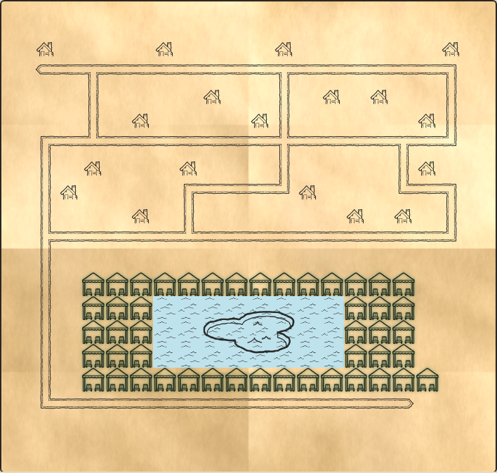

# Resort Map — poolside cabana booking

An interactive resort map drawn from an ASCII layout, with live cabana availability and a
one-step booking flow. The frontend holds no map data of its own: everything it draws comes
from the REST API.



## Run it

```bash
npm install
npm start
```

Then open <http://localhost:3000>.

To use different files, **keep the `--`** — it is how npm passes flags on to the app:

```bash
npm start -- --map map.ascii --bookings bookings.json --port 3000
```

> Without the `--`, npm swallows the flags itself (`npm warn Unknown cli config "--map"`) and the
> app quietly starts with its defaults. To make that obvious, startup prints the file it actually
> loaded and where the value came from:
>
> ```
> Resort map: http://localhost:3000 (default)
>   map:      /path/to/map.ascii (default) — 20x19
>   bookings: /path/to/bookings.json (--bookings) — 100 guests
> ```

| Flag | Default | Purpose |
| --- | --- | --- |
| `--map` | `map.ascii` | ASCII resort layout |
| `--bookings` | `bookings.json` | Guests allowed to book |
| `--port` | `3000` (or `PORT`) | Port to listen on |

`npm start` builds the frontend and then serves it, together with the API, from a single Express
process on one port — so one command really does start everything.

## Test it

```bash
npm test                      # map parsing, booking rules, REST API (65 tests)
npx playwright install chromium
npm run test:e2e              # the booking flow in a real browser (5 tests)
npm run typecheck
```

`npm test` runs Vitest against the real Express app with the real `map.ascii` and `bookings.json`
via Supertest — no mocks, no stubbed filesystem. `npm run test:e2e` builds and boots the app on
port 4173 with a small fixture guest list, drives Chromium through it, and regenerates
`screenshot.png`.

## The API

| Endpoint | Purpose |
| --- | --- |
| `GET /api/map` | The whole grid: tile types, plus an `id` and `booked` on every cabana |
| `POST /api/bookings` | Book a cabana — `{ "cabanaId": "3,11", "room": "101", "guestName": "Alice Smith" }` |

`GET /api/map` returns the map and its availability in one call:

```jsonc
{
  "width": 20,
  "height": 19,
  "tiles": [
    [{ "type": "empty" }, { "type": "chalet" }],
    [{ "type": "cabana", "id": "1,1", "booked": false }, { "type": "pool" }]
  ]
}
```

Failures come back as `{ "error": "<message meant for a guest>" }`:

| Status | When |
| --- | --- |
| `400` | A field is missing, or the room and name match no current guest |
| `404` | No such cabana on this map (including tiles that exist but are not `W`) |
| `409` | The cabana is taken, or that room already booked one |

## Design decisions and trade-offs

**One Express process serves both halves.** `npm start` builds the frontend and Express serves the
build next to `/api`. It costs a ~1s build on startup, but the reviewer gets one command, one port,
no proxy, and no `concurrently` — and it removes any doubt that the UI is talking to the real API.

**Each `W` tile is its own cabana**, identified by its coordinates (`"3,11"`). The README says the
guest "clicks on a cabana (`W`)", so a tile is the unit. Coordinates beat opaque ids because a
failing assertion names the spot you can point at on the map. They are only ever used as
`data-testid`, never as a DOM `id` — the comma would break `#id` selectors.

**Bad room/name is `400`, not `403`.** The task removes auth from scope ("knowing room number and
guest name is sufficient auth"), so a wrong name is a failed validation, not a failed
authorization. `401` would be wrong without a `WWW-Authenticate` challenge, and nothing in the UI
branches on the status anyway — it renders the message.

**One live booking per room.** Otherwise one guest could take the whole poolside. It also gives a
second, clearer 409 ("Room 101 already has a cabana booked for today") than a bare conflict.

**No `GET /api/bookings`.** `GET /api/map` already carries `booked` for every cabana, so a booking
list is a second source of truth the frontend never reads — and it would publish the guest names
that are themselves the credential. Bookings live in memory and are gone on restart, as allowed.

**Names are compared leniently** (trimmed, collapsed whitespace, case-insensitive): guests type
their own name. Room numbers are strings in `bookings.json`, so the form uses
`type="text" inputMode="numeric"` — `type="number"` would submit `101` and never match `"101"`.

**Booked cabanas stay clickable.** They must be able to say they are unavailable, so they are
greyed out and crossed rather than `disabled` — a disabled button fires no click and could not
explain itself.

**The path sprites are rotated, not duplicated.** Their base orientations were measured from the
artwork (`arrowStraight` joins N–S, `arrowCornerSquare` N–E, `arrowSplit` N–S–E, `arrowEnd` S,
`arrowCrossing` all four), then each `#` picks a sprite and a rotation from the neighbours it has.

**The pool is water plus one drawing.** `textureWater.png` tiles across every `p` cell, and
`pool.png` is laid over the pool once, `object-fit: contain` — it is a picture of a pool, not a
tile, and stamping it into all 24 cells looks broken. A map whose pool tiles are not a single
filled rectangle (two pools, an L shape) gets plain water instead of one drawing stretched across
the lot.

## Assumptions

- A blank line at the end of the map is ignored; short rows are padded with empty space and a space
  counts as empty — a map is a drawing, and editors lose trailing whitespace. Any other unknown
  character is rejected, naming its row and column.
- `.gitattributes` pins `*.ascii` to LF. The map is parsed character by character, so a CRLF
  checkout on Windows would otherwise put a stray `\r` at the end of every row.
- There are 47 cabanas and 100 guests, so not everyone can have one at the same time. That is the
  data as given.
- Assets are duplicated under `web/public/assets` so Vite can hash and copy them into the build.

## Layout

```
server/    map parsing, booking rules, the Express app, the CLI
web/       React frontend (tiles.ts holds the sprite/rotation logic)
e2e/       Playwright specs and their fixture guest list
map.ascii, bookings.json   the sample files, used as the defaults
```
